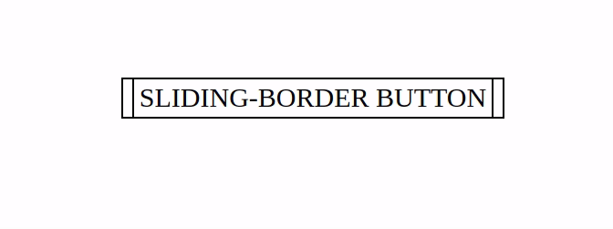

# Tutorial
# Botão com bordas animadas, em HTML e CSS

A ideia para o botão foi retirada do site oficial do escritor Haruki Murakami (https://www.harukimurakami.com). Achei um desafio interessante descobrir como foi feito e reproduzir. Agora trago aqui um tutorial, tentando explicar da forma mais simples possível.

## Inspiração


## Setup inicial
- uma página HTML simples.
- um elemento \<a> contendo seis elementos \<p> e um texto qualquer.

```HTML
<a href="google.com">
  SLIDING-BORDER BUTTON
  <p class="left-top"></p>
  <p class="right1"></p>
  <p class="right2"></p>
  <p class="right-bottom"></p>
  <p class="left1"></p>
  <p class="left2"></p>
</a>
```
```CSS
a {
  height: 35px;
  position: relative;
  color: inherit;
  text-decoration: none;
  margin: auto;
  font-size: 30px;
  padding: 5px 20px;
}
```
Na verdade as bordas serão elementos \<p>, vazios, com background preto e tamanhos fazendo parecer que são bordas reais.
Para que possamos posicionar os elementos nos cantos, o elemento parent \<a> precisa ter <strong>position: relative</strong>, e cada \<p> <strong>position: absolute</strong>.

## 1. A borda de cima
- Adicionar o posicionamento, tamanho e background:
```CSS
.left-top {
  margin: 0;
  position: absolute;
  left: 0;
  top: 0;
  background-color:black;
  height: 2px;
  width: 100%;
  transition: linear .6s;
}
```
- Adicionar a animação:
```CSS
a:hover .left-top {
  width: 0;
}
```
Caso o seletor fosse somente <strong>.left-top</strong> o mouse precisaria estar em cima da borda para a animação funcionar. Colocando <strong>a:hover .left-top</strong>, o mouse estando em qualquer lugar do elemento parent \<a> ativará a animação

## 2. A borda dupla na direita
A borda é feita por dois elementos \<p>, um posicionado em <strong>right: 0</strong> e outro em <strong>right: 12px</strong>, ou seja, a 12px da borda direita.

- A borda é fe:
```CSS
.right1, .right2 {
  margin: 0;
  position: absolute;
  background-color: black;
  height: 100%;
  width: 2px;
  transition: linear .5s;
}

.right1 {
  right: 12px;
  top: 0;
}

.right2 {
  right: 0;
  bottom: 0;
}

a:hover .right1, a:hover .right2 {
  height: 0;
}
```
 Embora os dois elementos sejam idênticos, um deles tem <strong>top: 0</strong> e outro <strong>bottom: 0</strong>. Isso é necessário para a animação: o elemento com <strong>top: 0</strong>, ao ser animado vai diminuir para cima, onde está sua base, enquanto que o elemento com <strong>bottom: 0</strong> tem a base embaixo, e portanto ao ser animado vai diminuir o <strong>height</strong> para baixo, criando esse efeito interessante.

## 3. A borda inferior
A borda inferior é igual à superior, mas, da mesma forma, tem <strong>right: 0</strong> em vez de <strong>left: 0</strong>, o que fará com que ela desapareça para a direita:
```CSS
.right-bottom {
  margin: 0;
  position: absolute;
  right: 0;
  bottom: 0;
  background-color:black;
  height: 2px;
  width: 100%;
  transition: linear .6s;
}

a:hover .right-bottom {
  width: 0;
}
```

## 4. A borda dupla na esquerda
As duas bordas na esquerda funcionam da mesma forma da borda na direita:
```CSS
.left1, .left2 {
  margin: 0;
  position: absolute;
  background-color:black;
  height: 100%;
  width: 2px;
  transition: linear .5s;
}

.left1 {
  left: 0px;
  top: 0px;
}

a:hover .left1 {
  height: 0;
}

.left2 {
  left: 12px;
  bottom: 0px;
}

a:hover .left2 {
  height: 0;
}
```

---
## Resultado


Ver online: https://ricardorosa-dev.github.io/sliding-border-buttons/sliding-button.html
